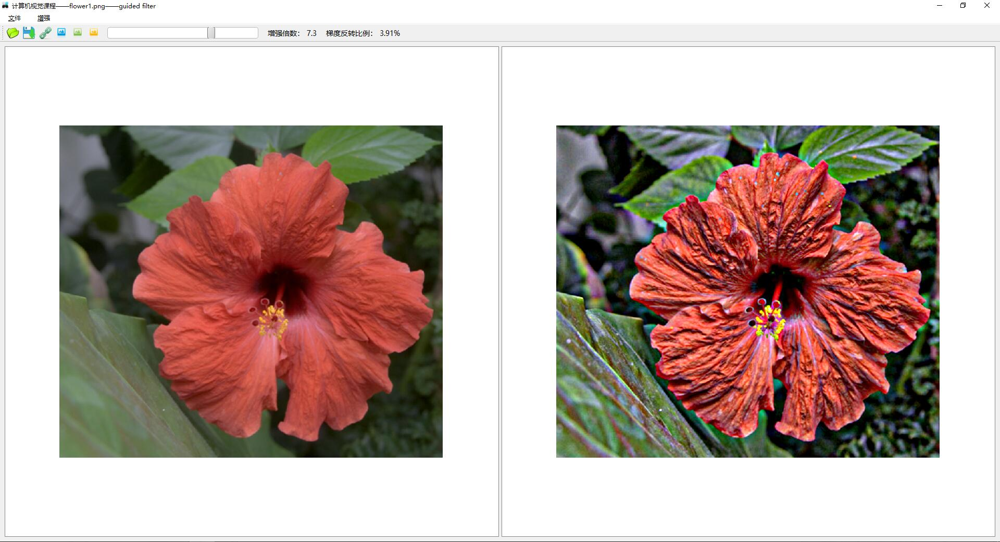

# CVCourse_ImageFilter

### Display image filtering: 
### Gudied Flier,L0 smooth Fliter, Bilateral Fliter

This code comes from my computer vision course homework.

The interface is written in python3 and depends on the PyQt5 framework.

The filtering algorithm is written in Visual C++, mainly written by my classmates, depending on OpenCV.

BoostPython is used to call the C++ dll(pyd) module for Python.

The main interface is as follows：

